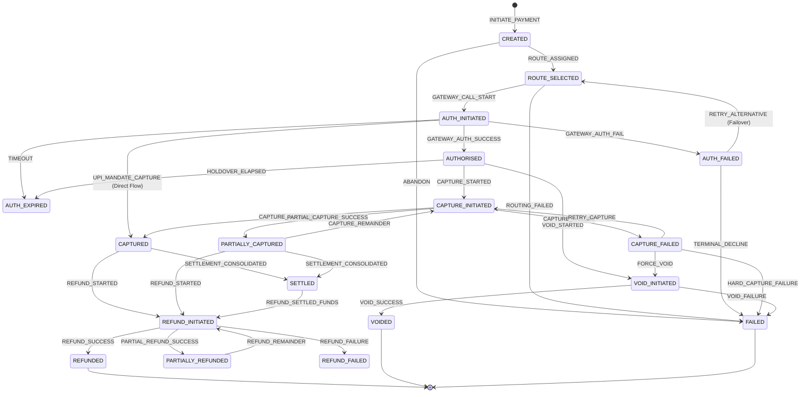

# Payment Transaction State Machine Specification

This document defines the deterministic transition states, events, and audit logging mechanics implemented within the PayFlow Payment Orchestration Layer.

## 1. Complete State Hierarchy (12+ Required States)

Our production-grade state machine tracks 12+ explicit, distinct states to completely distinguish phases of the payment cycle:

| State | Category | Description |
| :--- | :--- | :--- |
| `CREATED` | Initial | Transaction record initialized; no gateway interaction yet. |
| `ROUTE_SELECTED` | Routing | Dynamic routing scorer assigned the transaction to a target gateway. |
| `AUTH_INITIATED` | Authorization | API request dispatched to the target gateway; response pending. |
| `AUTHORISED` | Authorized | Funds held on customer account by the gateway; awaiting merchant capture. |
| `AUTH_FAILED` | Fail-safe | Authorization request rejected by the issuing bank or gateway. |
| `AUTH_EXPIRED` | Expired | Authorization hold period elapsed without a capture. |
| `CAPTURE_INITIATED` | Capture | Merchant capture call dispatched to gateway; response pending. |
| `CAPTURED` | Captured | Funds successfully transferred from customer to merchant. |
| `PARTIALLY_CAPTURED` | Partial | Portion of the authorized funds captured; remaining hold is retained. |
| `CAPTURE_FAILED` | Fail-safe | Capture request rejected by gateway (causes fallback status check). |
| `REFUND_INITIATED` | Refund | Refund request dispatched to gateway; response pending. |
| `PARTIALLY_REFUNDED` | Partial | Fraction of captured amount refunded; balance remaining. |
| `REFUNDED` | Terminal | Full captured value successfully refunded to the customer. |
| `REFUND_FAILED` | Fail-safe | Refund request rejected by gateway; allows retry. |
| `VOID_INITIATED` | Void | Request to cancel authorized hold dispatched to gateway. |
| `VOIDED` | Terminal | Authorized hold successfully cancelled; funds released. |
| `SETTLED` | Terminal | Gateway settled funds into the merchant's bank account. |
| `FAILED` | Terminal | Hard decline or terminal failure; no further recovery possible. |

---

## 2. State Transition Diagram (Mermaid)

---

## 3. Strict State Enforcement & Auditing

1. **State Transition Validation**: Every attempt to change transaction state triggers `TransactionStateMachine.isValidTransition(from, to)`. Invalid transitions (e.g. `CREATED` -> `REFUNDED`) immediately throw an `InvalidStateTransitionException` and write an audit log entry in the database with event type `REJECTED_TRANSITION`.
2. **Immutable Audit Trail**: All valid transitions write a detailed state log record containing:
   * Unique log ID
   * Transaction ID
   * From/To states
   * Triggering event (e.g. `GATEWAY_AUTH_SUCCESS`)
   * Gateway reference number
   * Full sanitized gateway JSON response
   * Actor system/user identifying who made the change (e.g. `webhook_processor`, `merchant_api`)
